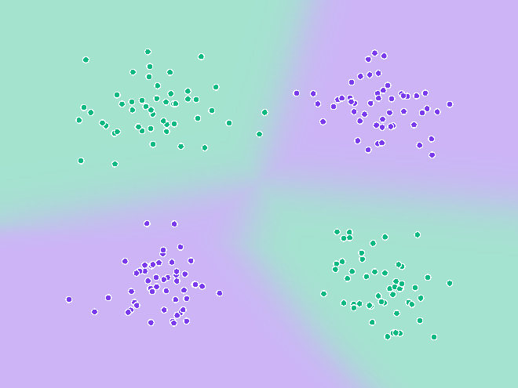
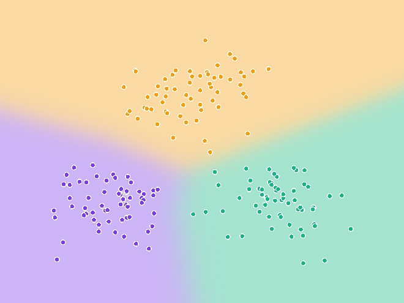
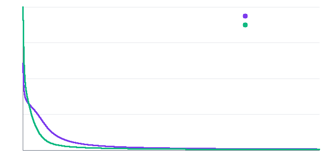
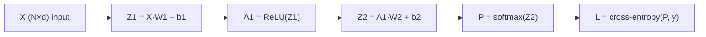

# Backprop from Scratch

A multi-layer perceptron and the backpropagation algorithm implemented in **pure Python — zero dependencies**. No numpy, no frameworks: just `math`, `random`, and the chain rule. Even the PNG visualizations below are generated by a hand-rolled image encoder built on stdlib `zlib` + `struct`.

The point of the project is to demystify what `loss.backward()` actually does: every gradient is derived by hand and coded explicitly, then verified against numerical finite differences before training starts.

## What the network learns

The network is trained on two synthetic tasks. **Noisy XOR** is the classic proof that the hidden layer matters — no linear model can separate it — and the trained network carves the plane into the four-quadrant checkerboard:

| Noisy XOR (2 classes) | Gaussian clusters (3 classes) |
| :---: | :---: |
|  |  |

Each plot shades the input plane by the network's predicted class probabilities (the soft gradient near boundaries is the softmax being genuinely uncertain) with the training points overlaid.

Cross-entropy loss over training, x-axis normalized to training progress (**violet = XOR**, **green = clusters**):



## Quick start

```bash
python3 backprop.py     # train both tasks, print loss/accuracy + ASCII curves
python3 visualize.py    # regenerate the PNGs in assets/
```

Sample output:

```
Gradient check vs. central differences: max relative error = 1.68e-09  [OK]
  epoch    1 | loss 1.0989 | accuracy  39.50%
  epoch   60 | loss 0.2227 | accuracy 100.00%
  ...
  final      | loss 0.0124 | accuracy 100.00%
```

## Architecture



A single hidden layer (8 ReLU units by default), softmax output, categorical cross-entropy loss, full-batch gradient descent, and He initialization so the ReLU gradients neither vanish nor explode at the start.

## The math

The backward pass applies the chain rule layer by layer. The key result is that softmax composed with cross-entropy collapses to a remarkably clean gradient:

$$\frac{\partial L}{\partial z_j} = p_j - \mathbb{1}\{j = y\}$$

i.e. *predicted probability minus one-hot target*. From there, each layer follows the same two patterns:

| Quantity | Gradient | Why |
| --- | --- | --- |
| `dZ2` | `(P − Y) / N` | softmax + CE simplification above; the `1/N` from the mean loss is folded in once here |
| `dW2` | `A1ᵀ · dZ2` | weight `W2[t][j]` touches output `Z2[i][j]` through activation `A1[i][t]` |
| `db2` | column-sums of `dZ2` | the bias feeds every sample identically |
| `dA1` | `dZ2 · W2ᵀ` | propagate the error back through the linear layer |
| `dZ1` | `dA1 ⊙ 1{Z1 > 0}` | ReLU passes gradient only where it was active |
| `dW1`, `db1` | `Xᵀ · dZ1`, column-sums of `dZ1` | same pattern as the output layer |

A full derivation of the softmax/cross-entropy simplification is in the `MLP.backward` docstring in [`backprop.py`](backprop.py).

## Gradient checking

Before training, the analytic gradients are verified against central finite differences:

$$\frac{\partial L}{\partial w} \approx \frac{L(w + \varepsilon) - L(w - \varepsilon)}{2\varepsilon}$$

Both runs agree with the hand-derived gradients to a max relative error of ~10⁻⁸–10⁻⁹ — the strongest evidence the calculus is right, independent of whether training happens to converge.

## Results

| Task | Samples | Classes | Final loss | Final accuracy |
| --- | --- | --- | --- | --- |
| Noisy XOR | 200 | 2 | 0.0124 | 100% |
| Gaussian clusters | 180 | 3 | 0.0073 | 100% |

## Project layout

```
backprop-from-scratch/
├── backprop.py     # matrix ops, MLP, explicit gradients, training loop, ASCII curves
├── visualize.py    # decision boundaries + loss curves as PNGs (stdlib-only encoder)
└── assets/         # generated images
```

## Design notes

- **Matrices are lists of row-lists** (`M[i][j]`), with a small set of explicit operations (`matmul`, `transpose`, `col_sums`, …) instead of a tensor library — every operation backprop needs is visible in ~50 lines.
- **Softmax uses the max-subtraction trick** for numerical stability, and cross-entropy clamps probabilities away from `log(0)`.
- **The `1/N` is applied exactly once** (inside `dZ2`), so every downstream gradient inherits the mean automatically — a classic source of bugs in hand-rolled backprop.
- **`visualize.py` writes PNGs from scratch**: PNG signature, IHDR/IDAT/IEND chunks, zlib-compressed scanlines. The decision boundaries are rendered by running the trained network's forward pass over a pixel grid.
